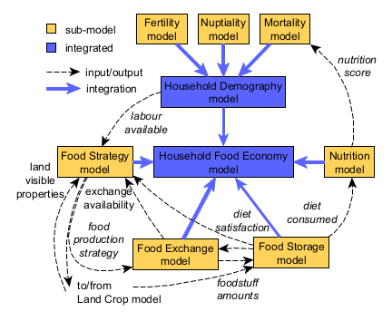

# Foodways, Nutrition, and Demography in the Indus Village model
Presentation for the session "Formal modelling and models of social complexity - in concepts, numbers, equations and agents" (S12) in the "Computer Applications & Quantitative Methods in Archaeology" (CAA) 2022 - “Inside Information” conference (8-11 August 2022)

CAA 2022 conference page: https://2022.caaconference.org/

Prepared with reveal.js (see https://revealjs.com/)

Slides: https://andros-spica.github.io/CAA-Angourakis-et-al-2022/

Authors
Andreas Angourakis, Jennifer Bates, Akshyeta Suryanarayan, Cameron A. Petrie

For more information on authors and project: https://www.arch.cam.ac.uk/research/projects/two-rains

Extended abstract:

*Introduction*
We present the latest advances in the continued development of the Indus Village model. As part of the TwoRains ERC project (2015-2021, University of Cambridge), the model aims to explore the sustainability of food-producing regimes during the urban phase of the Indus Civilisation (c. 2500 to 1900 BC) under the highly variable and diverse landscapes of the Indus River Basin. 

*Material & methods*
The Indus Village is designed as an agent-based modular system, prioritising intelligibility, reproducibility, and extensibility (Angourakis et al. 2020). Each module or sub-model has been progressively developed, documented, explored, and combined into higher-level models, all publicly available (Angourakis 2021). Each model often touches different disciplines and fields and relies on different reasoned assumptions and referenced datasets.

Having recently consolidated the models involved directly in crop dynamics as the Land Crop model (Angourakis et al., 2022), we move on to integrating the Household Food Economy model, containing the Food Strategy, Food Storage, Food Exchange, Nutrition, and Household Demography models. This model represents the part of the food economy cycle defined as a sequence of processes happening on a household scale, spanning from the obtention of foodstuffs to the disposition of labour and dietary preferences towards food production. Households obtain a series of foodstuff amounts in different moments of the annual calendar through crop cultivation, animal husbandry, fishing, gathering, hunting and exchange (activities evidenced in the context of the Indus Civilisation). These amounts are accounted for as stocks of foodstuff that are stored, exchanged, and consumed. Food consumption is calculated daily, assuming that households pursue the satisfaction of a diet, i.e. a composition of foodstuff amounts, which is treated as a cultural trait specific to households. The food effectively consumed is translated into nutrient amounts, and distributed among household members. Nutrient amounts are compared to the members' specific sex-age requirements, producing a household-level nutrition score. Next, the nutrition score modulates an equation-based mortality sub-model inside the Household Demography model, which also encompasses equivalent sub-models for fertility and nuptiality. Each household holds an ever-changing population, from which an amount of labour is made available for investment back into food production activities. To close the food economy cycle, the Food Strategy model determines how households apply a learning algorithm to steer their food production strategy, specifically regarding which activities to invest labour in, considering diet satisfaction as the fundamental target.

*Results*
This paper summarises the behaviour and parameter sensitivity of each sub-model included in the Household Food Economy model. We highlight how the Food Storage model brings the importance of storage technology and food sharing norms for a sustainable collective food economy, while non-local food sharing or trade are exposed by the Food Exchange model as impactful factors of resilience. We further comment on the dynamics of the Nutrition model, which reveals in explicit terms how diet composition and volume reflect in the satisfaction of nutrient requirements of a sex-age structured population, beyond a simple account of calories per capita. The significantly more variable behaviour of the Household Demography model is classified into qualitatively distinct groups (e.g., failure or collapse, pseudo-exponential growth, growth cycles), which are characterised parametrically and compared to patterns observed in real population dynamics. We further summarise the implications of alternative algorithms in the Food Strategy model, particularly on how these can impact the balance between diversification and specialisation in the population. Last, we introduce preliminary results of a set of experiments done on the Household Food Economy, focused on testing specific scenarios of interest and exposing the main implications and caveats of the integrated model.

*Discussion*
We do not expect to answer our overall questions with anything but the complete Indus Village model. However, the process of model development and the results obtained so far have been valued contributions to advancing the research agenda associated with TwoRains. We believe that the model presented here complements the study of the Indus Civilisation and its food economies, while its role in the Indus Village will help to test and improve the hypotheses about the de-urbanisation of the region after this period, among which is climate change. Furthermore, by creating a modular model of prehistoric agriculture and food economy (that remains public and documented), we hope to have a longer and broader impact on the community of modellers of socio-ecological systems in archaeology.

*References*

Angourakis, Andreas, Jennifer Bates, Jean-Philippe Baudouin, Alena Giesche, M. Cemre Ustunkaya, Nathan Wright, Ravindra Nath Singh, and Cameron Andrew Petrie. 2020. ‘How to ‘downsize’ a Complex Society: An Agent-Based Modelling Approach to Assess the Resilience of Indus Civilisation Settlements to Past Climate Change’. Environmental Research Letters 15 (11): 115004. https://doi.org/10.1088/1748-9326/abacf9.

Angourakis, Andreas. 2021. ‘Two-Rains/Indus-Village-Model: The Indus Village Model Development Files (v0.4)’. Zenodo, May. https://doi.org/10.5281/zenodo.4814255.

Angourakis, Andreas, Jennifer Bates, Jean-Philippe Baudouin, Alena Giesche, Joanna R. Walker, M. Cemre Ustunkaya, Nathan Wright, Ravindra Nath Singh, and Cameron A. Petrie. 2022. ‘Weather, Land and Crops in the Indus Village Model: A Simulation Framework for Crop Dynamics under Environmental Variability and Climate Change in the Indus Civilisation’. Quaternary 5 (2): 25. https://doi.org/10.3390/quat5020025.
